
<h1 align="center">Gazeta Marista Irmão Acácio</h1>

Um projeto desenvolvido pela disciplina de Língua Portuguesa sob orientação da professora Carla Ravaneda, em parceria com o projeto Educomunicação orientado por Aline Querino.

  

## Sobre

A Gazeta Marista é um projeto jornalístico desenvolvido pela professora Carla Ravaneda, de Língua Portuguesa, em parceria com o projeto Educomunicação, orientado por Aline Querino.

O jornal teve sua origem no [1º Marista.com-Partilhar](https://www.instagram.com/p/Cl01IYWODaJ/), de 2022, realizado na Escola Social Marista Irmão Acácio. Em 2023, o projeto foi continuado e expandido para sua [versão web](https://maristairacacio.github.io/GazetaMarista/), com o apoio de Leonardo Rocha, professor de Desenvolvimento e Programação Web.

O periódico será alimentado quinzenalmente com novas matérias, escritas por nossos redatores, e manutenções serão feitas frequentemente, com melhorias de código, UI e UX.

## A Equipe

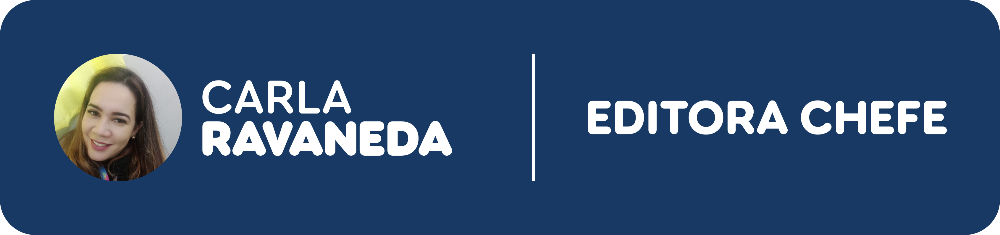 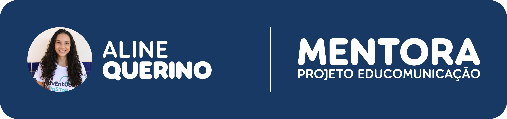
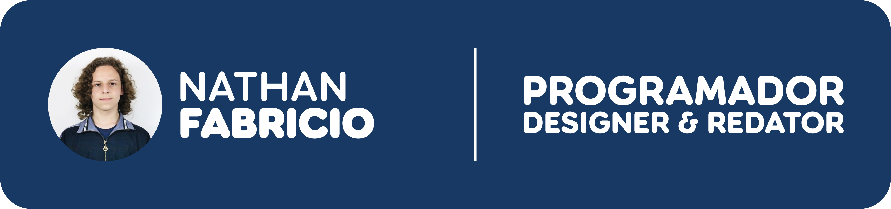 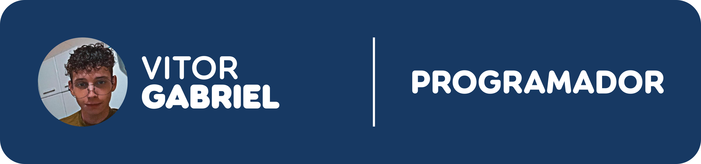 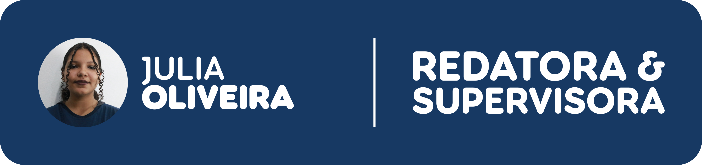
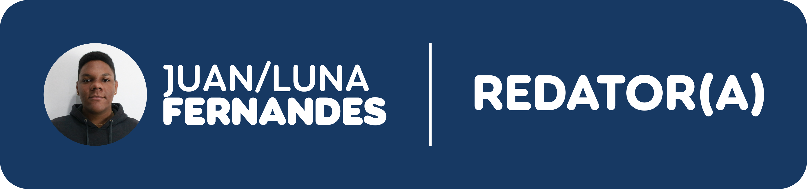
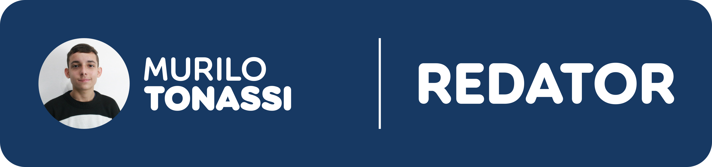
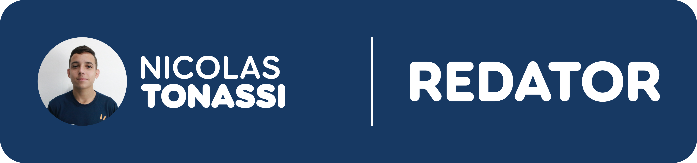
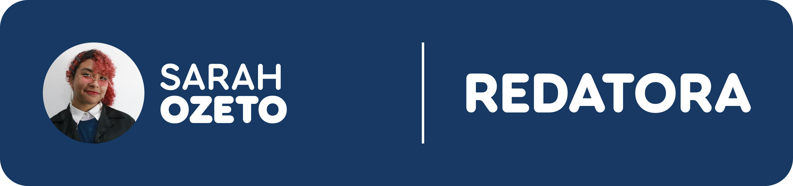 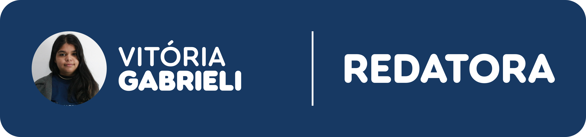

## Próximos Passos

* Integrar um editor de matérias, permitindo a escrita de notícias no próprio site por meio de um sistema de administração (contas de editores) e salvamento de matérias como rasunho para futura continuidade;
* Aprimorar a interface e experiência do usuário.

---

  <a href="https://maristaescolassociais.org.br/escola/marista-escola-social-ir-acacio/">
    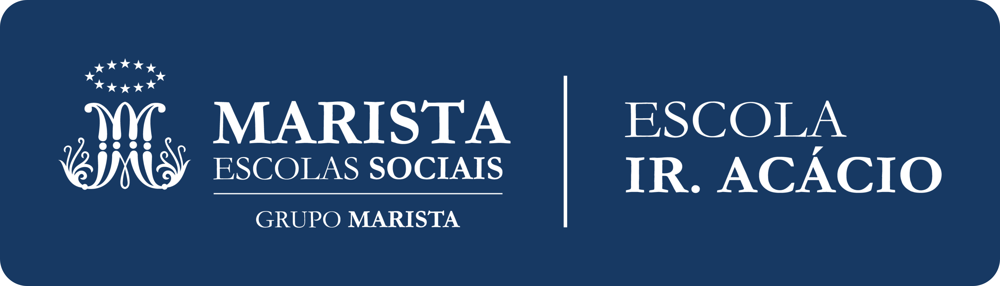
  </a>

  

